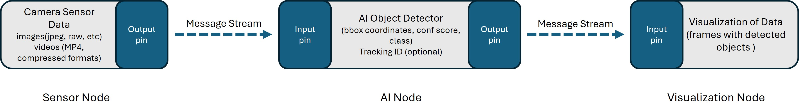

    <h2 align="center">
        Implementation of an AI Node in Python using the DRAIVE Link Framework
    </h2>
    

        DRAIVE Link is a framework that enables high-performance distributed software systems. It is based on a decentralized, consumer-driven publish-subscribe architecture. For more details about the architecture and system components, refer to the official <a href="https://pages.draive.com/link2/#reactive-mesh-for-realtime-data-processing">documentation</a>. In this project, we will implement a Link Node in Python that uses an object detection AI algorithm as the primary use case. 
    

---
### An overview of an example workflow 
 

### Camera sensor node
- This node is connected to a camera sensor which captures data from the environment.
- The captured frame data will either be pre-processed or directly feed into the message stream in the form of data objects (offers) through the output pin of the concerned node instance.
- More information about the structure of the data fields inside the data objects will be updated later as per the requirements.

### AI Node

- The AI node in our case consist of an object detection model (currently [Yolov11](https://docs.ultralytics.com/models/yolo11/)) for detection of objects (vehicle class). Tracking will also be added to the node with the option of turning it ON or OFF in the instance file depending on the output requirements from the AI model for downstream applications.
- The input pin of the AI node demands the image data objects to be in a certain format that is compatible with the Yolov11 model (atleast for the initial part of creation of this node for simplicity). Later, the code will be modified to do the pre-processing of the input data within the node for making it compatible with general applications.
- Configuration files (instance.json and specification.json) have to be created according to the intended behviour of the node.
- The AI node will publish the bounding box coordinates along with the class and confidence score of the detected object from the output pin along with the provision of tracking ID into the message stream.
### Visualization Node
-   This node is responsible for visualizing the detected objects in the frame.
- It will subscribe to the output data from the AI node and also subscribe to the source image frame data. (Synchronous operation between image frame and the output data from 2 different nodes in case of visualization node is an open question to me at the moment).
- This section or node will be updated at a later point as we gain more insights into the capabilites of the AI Node.

